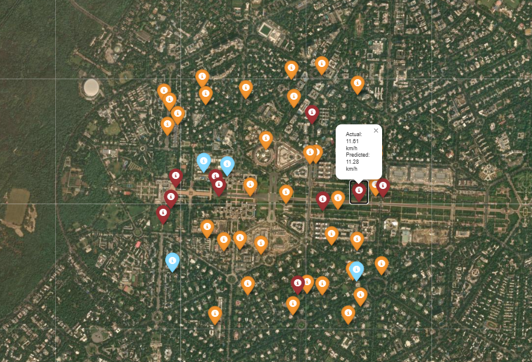
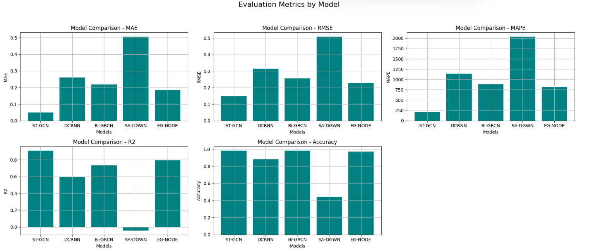
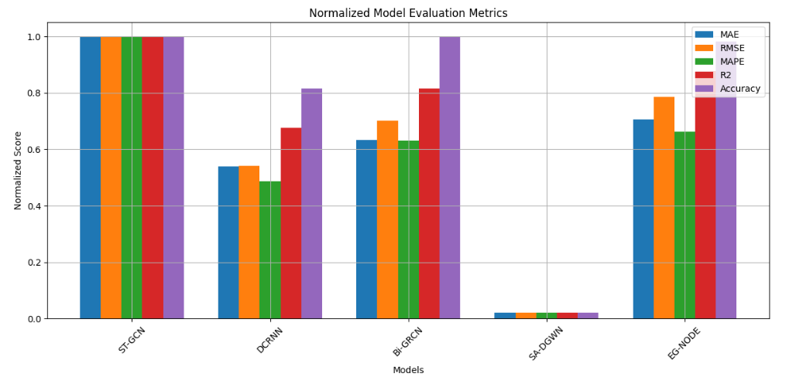
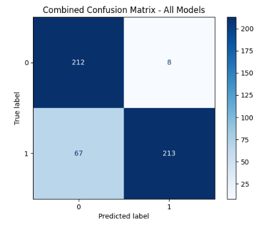

# 🚦 Real-Time Traffic Flow Prediction Using ST-GCN

> Predicting traffic flow using Spatio-Temporal Graph Convolutional Networks (ST-GCN) by modeling both spatial road-network dependencies and temporal traffic dynamics.

---

## Project Overview

Traffic forecasting is a critical component of Intelligent Transportation Systems (ITS). Traditional machine learning approaches often fail to effectively capture the spatial connectivity of road networks while simultaneously modeling temporal traffic patterns.

This project implements a **Spatio-Temporal Graph Convolutional Network (ST-GCN)** that represents road segments as graph nodes and traffic relationships as graph edges, enabling the model to learn complex spatio-temporal dependencies for traffic flow prediction.

<p align="center">
  
</p>


---

## Architecture

The model consists of:

- Graph Convolution Layers for spatial learning
- Temporal Convolution Layers for sequential learning
- Fully Connected Layers for prediction
- Evaluation and visualization modules

---

## Key Features

✅ Graph-Based Traffic Network Modeling

✅ Spatio-Temporal Deep Learning Architecture

✅ Traffic Flow Forecasting

✅ Benchmarking Against Multiple Architectures

✅ Automated Evaluation Metrics

✅ Visualization & Performance Analysis

---

## Methodology

### 1. Data Representation

Road segments are represented as graph nodes.

```math
G = (V,E)
```

Where:

- V = Road Segments
- E = Connectivity Between Segments

---

### 2. Graph Construction

Spatial relationships are constructed using distance-based adjacency matrices.

Neighboring road segments are connected through graph edges to capture traffic propagation behavior.

---

### 3. ST-GCN Learning

The model jointly learns:

- Spatial dependencies through Graph Convolutions
- Temporal dependencies through Temporal Convolutions

allowing it to predict future traffic conditions more accurately than traditional approaches.

---

## Benchmark Models

The repository includes benchmarking for:

| Model | Description |
|---------|-------------|
| ST-GCN | Spatio-Temporal Graph Convolution Network |
| DCRNN | Diffusion Convolution Recurrent Neural Network |
| Bi-GRCN | Bidirectional Graph Recurrent Convolution Network |
| SA-DGWN | Spatial Attention Dynamic Graph WaveNet |
| EG-NODE | Edge-Guided Neural ODE |

---

## Evaluation Metrics

The models are evaluated using:

| Metric | Purpose |
|----------|---------|
| MAE | Mean Absolute Error |
| RMSE | Root Mean Squared Error |
| MAPE | Mean Absolute Percentage Error |
| R² | Coefficient of Determination |
| Accuracy | Classification Accuracy |

---

# Results

## Metric Comparison

<p align="center">
  
</p>

---

## Normalized Model Performance

<p align="center">
  
</p>

---

## Combined Confusion Matrix

<p align="center">
  
</p>

---

## Project Structure

```text
Real-Time-Traffic-Flow-Prediction-Using-STGCN
│
├── train.py
├── benchmark.py
├── config.py
│
├── models/
│   ├── architectures.py
│   └── __init__.py
│
├── data/
│
├── assets/
│   ├── benchmark_metric_subplots.png
│   ├── benchmark_normalized.png
│   └── benchmark_confusion_matrix.png
│
├── requirements.txt
├── README.md
└── .gitignore
```

---

## Installation

Clone the repository:

```bash
git clone https://github.com/YOUR_USERNAME/Real-Time-Traffic-Flow-Prediction-Using-STGCN.git
```

Move into the project directory:

```bash
cd Real-Time-Traffic-Flow-Prediction-Using-STGCN
```

Install dependencies:

```bash
pip install -r requirements.txt
```

---

## Usage

### Train Model

```bash
python train.py
```

### Run Benchmark

```bash
python benchmark.py
```

### Custom Benchmark

```bash
python benchmark.py --samples 1000 --epochs 50
```

---

## Technologies Used

- Python
- PyTorch
- PyTorch Geometric
- NumPy
- Pandas
- Scikit-Learn
- NetworkX
- Matplotlib

---

## Applications

- Smart Cities
- Intelligent Transportation Systems
- Traffic Congestion Analysis
- Urban Mobility Planning
- Route Optimization
- Transportation Research

---

## Future Improvements

- Real-world traffic datasets
- Dynamic graph construction
- Attention-based graph networks
- Multi-step forecasting
- Real-time deployment
- Web dashboard integration

---

## Authors

### Surya Singha
### Pramiti Shekhar Singh
